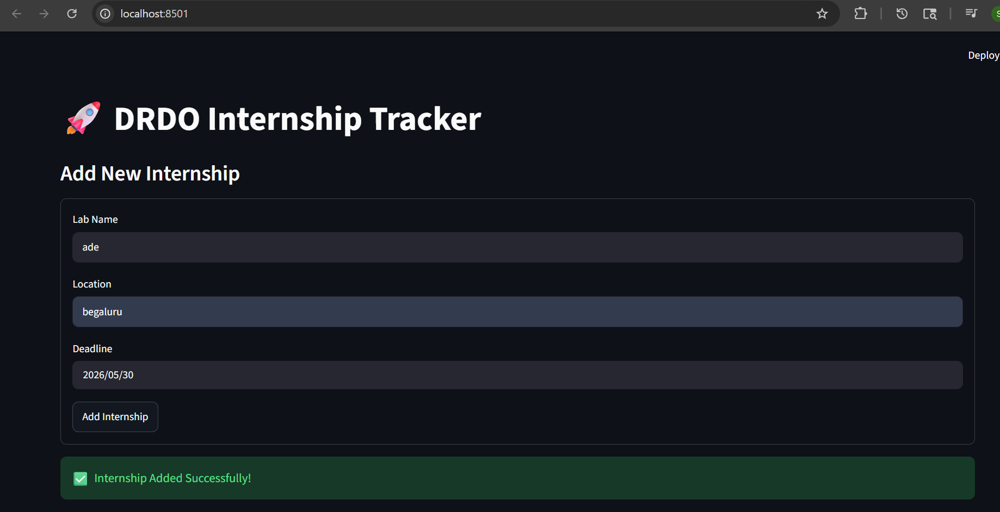
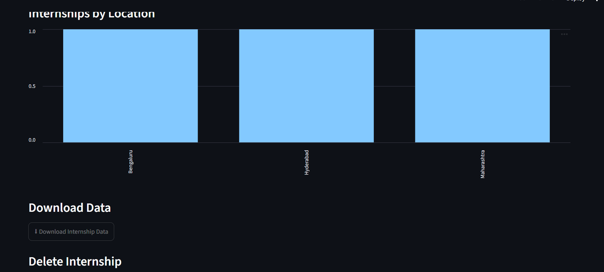
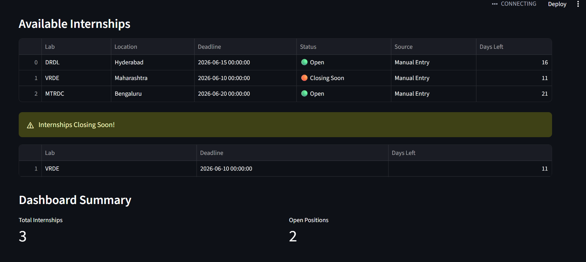

# 🚀 DRDO Internship Tracker

A Python and Streamlit-based internship management system designed to track internship opportunities, monitor deadlines, and provide analytics through an interactive dashboard.

## Features

* Add Internship Records
* Delete Internship Records
* Search Internships
* Filter by Status
* Automatic Deadline Tracking
* Days Left Calculation
* Internship Analytics Dashboard
* CSV Data Storage
* Download Internship Data

## Technologies Used

* Python
* Streamlit
* Pandas
* Requests
* BeautifulSoup

## Project Structure

```text
DRDO-Internship-Tracker
│
├── app.py
├── scraper.py
├── requirements.txt
├── README.md
│
└── data
    └── internships.csv
```

## Installation

```bash
pip install -r requirements.txt
streamlit run app.py
```
## 📸 Project Screenshots

### Dashboard



### Analytics Graph



### Dashboard Summary



## Live Demo

https://drdo-internship-tracker-sreeja.streamlit.app/
## Future Improvements

* Deadline Reminder System
* ISRO Internship Tracking
* Cloud Deployment

## Author

Sreeja
